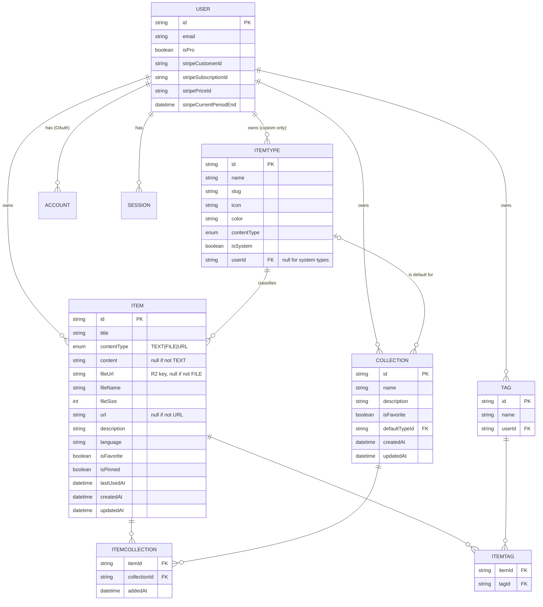
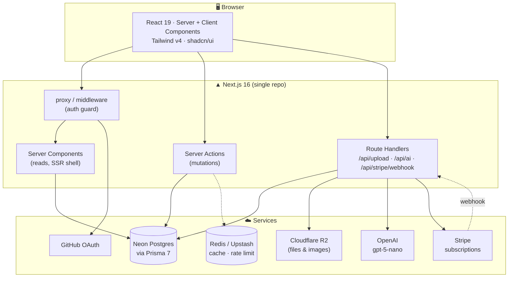
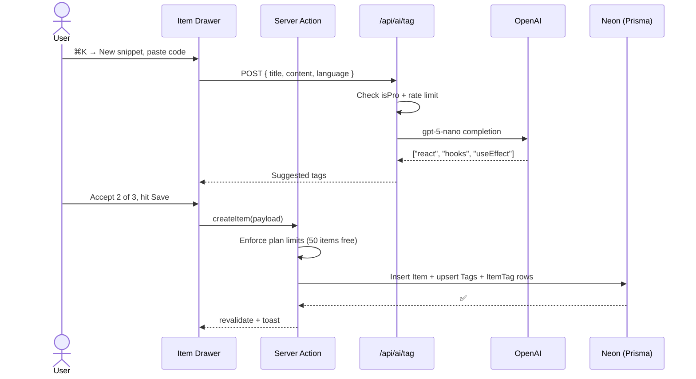
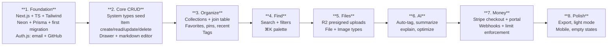

# 📦 DevStash — Project Overview

> **One fast, searchable, AI-enhanced hub for everything a developer stashes:** snippets, prompts, commands, notes, links, and files.

|                  |                                                                                                        |
| ---------------- | ------------------------------------------------------------------------------------------------------ |
| **Status**       | Planning / pre-build                                                                                   |
| **Type**         | Freemium SaaS (B2C, single-tenant per user)                                                            |
| **Stack**        | Next.js 16 · React 19 · TypeScript · Postgres (Neon) · Prisma 7 · Auth.js v5 · Tailwind v4 + shadcn/ui |
| **Last updated** | September 2026                                                                                         |

---

## 1. 🎯 Problem

Developers keep their essentials scattered across a dozen places:

| Asset         | Where it usually lives       |
| ------------- | ---------------------------- |
| Code snippets | VS Code, Notion              |
| AI prompts    | Buried in chat histories     |
| Context files | Random project folders       |
| Useful links  | Browser bookmarks            |
| Docs          | Downloads folder             |
| Commands      | `notes.txt`, `.bash_history` |
| Boilerplates  | GitHub gists                 |

The result is **context switching, lost knowledge, and inconsistent workflows**. DevStash consolidates all of it into a single searchable surface with AI on top.

---

## 2. 👥 Users

| Persona                        | Primary need                                        | Types they lean on     |
| ------------------------------ | --------------------------------------------------- | ---------------------- |
| **Everyday Developer**         | Grab snippets, commands, links fast                 | Snippet, Command, Link |
| **AI-first Developer**         | Store prompts, contexts, system messages, workflows | Prompt, File, Note     |
| **Content Creator / Educator** | Reusable code blocks, explanations, course notes    | Snippet, Note          |
| **Full-stack Builder**         | Patterns, boilerplates, API examples                | Snippet, File, Link    |

**Common thread:** everyone wants _sub-second retrieval_. Search and the quick-open drawer are the core product, not side features.

---

## 3. ✨ Features

### A. Items & Item Types

Every item has exactly one **type**. Ship with seven immutable system types; user-defined custom types come later (Pro).

| Type    | Content kind | Color                | Icon (lucide) | Tier    |
| ------- | ------------ | -------------------- | ------------- | ------- |
| Snippet | `TEXT`       | `#3b82f6` 🔵 blue    | `Code`        | Free    |
| Prompt  | `TEXT`       | `#8b5cf6` 🟣 purple  | `Sparkles`    | Free    |
| Command | `TEXT`       | `#f97316` 🟠 orange  | `Terminal`    | Free    |
| Note    | `TEXT`       | `#fde047` 🟡 yellow  | `StickyNote`  | Free    |
| Link    | `URL`        | `#10b981` 🟢 emerald | `Link`        | Free    |
| File    | `FILE`       | `#6b7280` ⚪ gray    | `File`        | **Pro** |
| Image   | `FILE`       | `#ec4899` 🩷 pink    | `Image`       | **Pro** |

> ⚠️ **Spec conflict to resolve:** the notes describe three content kinds (text / url / file) but the `ITEM` model lists only `contentType (text | file)`. The schema below uses a three-value enum — `TEXT | FILE | URL` — since Link items store a `url` and no `content` or `fileUrl`.

> 🟡 **Accessibility note:** `#fde047` (Note yellow) fails contrast against a light background and is borderline on dark. Consider a slightly deeper `#eab308` for text/borders while keeping the bright yellow for fills.

**Behavior**

- Items are created and opened in a **quick-access drawer**, never a full page navigation.
- Type listing routes are slug-based: `/items/snippets`, `/items/prompts`, `/items/commands`, …

### B. Collections

User-defined groupings that can hold items of **any** type. Many-to-many: a React snippet can live in both _React Patterns_ and _Interview Prep_.

- `defaultTypeId` seeds the "new item" form for empty collections.
- Collection card background color = the color of its **most common item type**; ties break toward the most recently added item's type.
- Item cards inside a collection are color-coded by **border**, not background.

### C. Search

One search box, four surfaces:

```
title  ·  content  ·  tags  ·  type
```

Filterable by type, collection, favorite, and pinned state. See [§6 Search implementation](#6--search-implementation) for the technical approach.

### D. Authentication

- Email + password (credentials)
- GitHub OAuth

### E. Quality-of-life

| Feature                        | Notes                                                                                     |
| ------------------------------ | ----------------------------------------------------------------------------------------- |
| ⭐ Favorites                   | On both items and collections                                                             |
| 📌 Pin to top                  | Items only                                                                                |
| 🕘 Recently used               | Requires a `lastUsedAt` timestamp — **missing from the original data model**, added below |
| 📥 Import code from file       | Reads a local file into a text item                                                       |
| ✍️ Markdown editor             | For all `TEXT` types, with syntax-highlighted code blocks                                 |
| 📎 File upload                 | `FILE` types only (Pro)                                                                   |
| 📤 Export                      | JSON / ZIP (Pro)                                                                          |
| 🌙 Dark mode                   | Default; light mode optional                                                              |
| 🗂️ Multi-collection membership | Add/remove from many collections; item detail shows every collection it belongs to        |

### F. AI Features (Pro)

| Feature              | Input                | Output                                            |
| -------------------- | -------------------- | ------------------------------------------------- |
| Auto-tag suggestions | Title + content      | 3–5 suggested tags the user accepts/rejects       |
| Summaries            | Long text item       | 1–2 sentence description written to `description` |
| Explain This Code    | Snippet + `language` | Plain-English walkthrough                         |
| Prompt Optimizer     | Prompt item          | Rewritten, sharper prompt                         |

Model: **OpenAI `gpt-5-nano`**. All calls go through internal API routes — never expose the key client-side.

> 💡 **Suggestion:** every AI action should be _non-destructive_. Write results to a staging field or show a diff, and let the user accept. Silently overwriting a user's saved prompt is the fastest way to lose trust.

---

## 4. 🗄️ Data Model

### Entity relationship diagram



### Changes made to the original sketch

| #   | Change                                               | Why                                                                            |
| --- | ---------------------------------------------------- | ------------------------------------------------------------------------------ |
| 1   | `contentType` enum extended to `TEXT \| FILE \| URL` | Link items are neither text nor file                                           |
| 2   | Added `Item.lastUsedAt`                              | "Recently used" has no data behind it otherwise                                |
| 3   | Added `ItemTag` join table                           | `TAG` was listed with no relation; tags are many-to-many                       |
| 4   | Scoped `Tag` to a user (`@@unique([userId, name])`)  | Global tags leak one user's vocabulary into another's autocomplete             |
| 5   | Added `ItemType.slug` and `ItemType.contentType`     | Slug drives `/items/[slug]`; contentType tells the editor which form to render |
| 6   | Added Stripe `priceId` + `currentPeriodEnd` on User  | `isPro` alone can't tell you _when_ access lapses or which plan they're on     |
| 7   | Explicit `onDelete` rules + composite indexes        | Every query is user-scoped; unindexed it degrades fast                         |

### Prisma schema

> **Prisma 7 notes.** v7 replaces the `prisma-client-js` generator with **`prisma-client`**, makes `output` **required**, and requires a **driver adapter** (`@prisma/adapter-pg`) when instantiating `PrismaClient`. Config lives in `prisma.config.ts`. Verify against the [v7 docs](https://www.prisma.io/docs/orm/v7) before scaffolding — this moves fast.

```prisma
// prisma/schema.prisma

generator client {
  provider = "prisma-client"
  output   = "../src/generated/prisma"
}

datasource db {
  provider = "postgresql"
  url      = env("DATABASE_URL")
}

// ─── Enums ────────────────────────────────────────────────

enum ContentType {
  TEXT
  FILE
  URL
}

// ─── Auth (Auth.js v5 / Prisma adapter) ───────────────────

model User {
  id            String    @id @default(cuid())
  name          String?
  email         String    @unique
  emailVerified DateTime?
  image         String?
  passwordHash  String? // null for OAuth-only users

  // Billing
  isPro                  Boolean   @default(false)
  stripeCustomerId       String?   @unique
  stripeSubscriptionId   String?   @unique
  stripePriceId          String?
  stripeCurrentPeriodEnd DateTime?

  createdAt DateTime @default(now())
  updatedAt DateTime @updatedAt

  accounts    Account[]
  sessions    Session[]
  items       Item[]
  collections Collection[]
  itemTypes   ItemType[] // custom types only
  tags        Tag[]
}

model Account {
  id                String  @id @default(cuid())
  userId            String
  type              String
  provider          String
  providerAccountId String
  refresh_token     String?
  access_token      String?
  expires_at        Int?
  token_type        String?
  scope             String?
  id_token          String?
  session_state     String?

  user User @relation(fields: [userId], references: [id], onDelete: Cascade)

  @@unique([provider, providerAccountId])
  @@index([userId])
}

model Session {
  id           String   @id @default(cuid())
  sessionToken String   @unique
  userId       String
  expires      DateTime

  user User @relation(fields: [userId], references: [id], onDelete: Cascade)

  @@index([userId])
}

model VerificationToken {
  identifier String
  token      String   @unique
  expires    DateTime

  @@unique([identifier, token])
}

// ─── Core domain ──────────────────────────────────────────

model ItemType {
  id          String      @id @default(cuid())
  name        String // "Snippet"
  slug        String // "snippets" -> /items/snippets
  icon        String // lucide icon name
  color       String // hex, e.g. "#3b82f6"
  contentType ContentType @default(TEXT)
  isSystem    Boolean     @default(false)
  isProOnly   Boolean     @default(false)
  sortOrder   Int         @default(0)

  userId String? // null for the 7 system types
  user   User?   @relation(fields: [userId], references: [id], onDelete: Cascade)

  items              Item[]
  defaultForCollections Collection[] @relation("CollectionDefaultType")

  createdAt DateTime @default(now())

  @@unique([userId, slug])
  @@index([userId])
}

model Item {
  id          String      @id @default(cuid())
  title       String
  description String?
  contentType ContentType @default(TEXT)

  content  String? @db.Text // TEXT types
  url      String? // URL types
  fileUrl  String? // FILE types — R2 object key
  fileName String?
  fileSize Int? // bytes
  mimeType String?

  language String? // "typescript", "bash", … for highlighting

  isFavorite Boolean   @default(false)
  isPinned   Boolean   @default(false)
  lastUsedAt DateTime?

  createdAt DateTime @default(now())
  updatedAt DateTime @updatedAt

  userId String
  user   User   @relation(fields: [userId], references: [id], onDelete: Cascade)

  itemTypeId String
  itemType   ItemType @relation(fields: [itemTypeId], references: [id], onDelete: Restrict)

  collections ItemCollection[]
  tags        ItemTag[]

  @@index([userId, createdAt(sort: Desc)])
  @@index([userId, lastUsedAt(sort: Desc)])
  @@index([userId, itemTypeId])
  @@index([userId, isPinned])
  @@index([userId, isFavorite])
}

model Collection {
  id          String  @id @default(cuid())
  name        String
  description String?
  isFavorite  Boolean @default(false)

  defaultTypeId String?
  defaultType   ItemType? @relation("CollectionDefaultType", fields: [defaultTypeId], references: [id], onDelete: SetNull)

  createdAt DateTime @default(now())
  updatedAt DateTime @updatedAt

  userId String
  user   User   @relation(fields: [userId], references: [id], onDelete: Cascade)

  items ItemCollection[]

  @@unique([userId, name])
  @@index([userId, createdAt(sort: Desc)])
}

model ItemCollection {
  itemId       String
  collectionId String
  addedAt      DateTime @default(now())

  item       Item       @relation(fields: [itemId], references: [id], onDelete: Cascade)
  collection Collection @relation(fields: [collectionId], references: [id], onDelete: Cascade)

  @@id([itemId, collectionId])
  @@index([collectionId, addedAt(sort: Desc)])
  @@index([itemId])
}

model Tag {
  id   String @id @default(cuid())
  name String

  userId String
  user   User   @relation(fields: [userId], references: [id], onDelete: Cascade)

  items ItemTag[]

  createdAt DateTime @default(now())

  @@unique([userId, name])
  @@index([userId])
}

model ItemTag {
  itemId String
  tagId  String

  item Item @relation(fields: [itemId], references: [id], onDelete: Cascade)
  tag  Tag  @relation(fields: [tagId], references: [id], onDelete: Cascade)

  @@id([itemId, tagId])
  @@index([tagId])
}
```

> ⚠️ **Postgres gotcha on `@@unique([userId, slug])`:** Postgres treats `NULL`s as distinct, so this constraint will **not** prevent duplicate system types (where `userId` is null). Add a partial unique index by hand in a migration:
>
> ```sql
> CREATE UNIQUE INDEX itemtype_system_slug_key
>   ON "ItemType" (slug) WHERE "userId" IS NULL;
> ```

### 🚫 Migration policy (non-negotiable)

**Never** run `prisma db push` or alter the database structure by hand — in any environment.

```bash
# dev
npx prisma migrate dev --name add_item_last_used_at

# prod (CI)
npx prisma migrate deploy
```

Every schema change is a committed, reviewed migration file. Raw SQL (partial indexes, `tsvector` columns, GIN indexes) goes into a migration too — generate an empty one with `--create-only` and edit it.

---

## 5. 🏗️ Architecture



### Request flow — creating an AI-tagged snippet



---

## 6. 🔍 Search Implementation

Search spans title, content, tags, and type. Two viable approaches:

| Approach                | Good for                                | Trade-off                                    |
| ----------------------- | --------------------------------------- | -------------------------------------------- |
| **`ILIKE` + `pg_trgm`** | MVP, fuzzy/typo tolerance, short corpus | Slows down past ~10k rows per user           |
| **`tsvector` + GIN**    | Ranked full-text, scales well           | Needs a generated column + raw SQL migration |

**Recommendation:** start with `pg_trgm` for speed of delivery, then add a generated `tsvector` column when item counts justify it. Prisma's `@@fulltext` attribute is **MySQL-only**, so either path needs raw SQL in a migration.

```sql
-- Example migration (create-only, hand-edited)
CREATE EXTENSION IF NOT EXISTS pg_trgm;

ALTER TABLE "Item" ADD COLUMN search_vector tsvector
  GENERATED ALWAYS AS (
    setweight(to_tsvector('english', coalesce(title, '')), 'A') ||
    setweight(to_tsvector('english', coalesce(description, '')), 'B') ||
    setweight(to_tsvector('english', coalesce(content, '')), 'C')
  ) STORED;

CREATE INDEX item_search_idx ON "Item" USING GIN (search_vector);
CREATE INDEX item_title_trgm_idx ON "Item" USING GIN (title gin_trgm_ops);
```

Query via `prisma.$queryRaw`, always scoped by `userId`.

---

## 7. 🧭 Routing

| Route                 | Purpose                                |
| --------------------- | -------------------------------------- |
| `/`                   | Marketing / landing                    |
| `/login`, `/register` | Auth                                   |
| `/dashboard`          | Collection grid + recent items         |
| `/items`              | All items                              |
| `/items/[typeSlug]`   | `/items/snippets`, `/items/prompts`, … |
| `/collections`        | All collections                        |
| `/collections/[id]`   | Single collection                      |
| `/search?q=`          | Full search results                    |
| `/settings`           | Profile, theme, export                 |
| `/settings/billing`   | Stripe portal                          |
| `/api/upload`         | R2 presigned upload                    |
| `/api/ai/*`           | tag · summarize · explain · optimize   |
| `/api/stripe/webhook` | Subscription lifecycle                 |

**Drawer pattern:** individual items open in a drawer over the current page. Use a **URL search param** (`?item=<id>`) rather than pure local state, so items are linkable, shareable, and back-button friendly. Next.js parallel + intercepting routes are the alternative — heavier, but gives a real page on direct load.

---

## 8. 🧰 Tech Stack

| Layer              | Choice                                     | Docs                                                                  |
| ------------------ | ------------------------------------------ | --------------------------------------------------------------------- |
| Framework          | Next.js 16 (App Router, Turbopack default) | [nextjs.org/docs](https://nextjs.org/docs)                            |
| UI runtime         | React 19                                   | [react.dev](https://react.dev)                                        |
| Language           | TypeScript (strict)                        | [typescriptlang.org/docs](https://www.typescriptlang.org/docs/)       |
| Database           | Neon serverless Postgres                   | [neon.com/docs](https://neon.com/docs)                                |
| ORM                | Prisma 7                                   | [prisma.io/docs](https://www.prisma.io/docs)                          |
| Auth               | Auth.js v5 (NextAuth)                      | [authjs.dev](https://authjs.dev)                                      |
| File storage       | Cloudflare R2 (S3-compatible)              | [developers.cloudflare.com/r2](https://developers.cloudflare.com/r2/) |
| Payments           | Stripe Subscriptions                       | [docs.stripe.com/billing](https://docs.stripe.com/billing)            |
| AI                 | OpenAI `gpt-5-nano`                        | [platform.openai.com/docs](https://platform.openai.com/docs)          |
| Styling            | Tailwind CSS v4                            | [tailwindcss.com/docs](https://tailwindcss.com/docs)                  |
| Components         | shadcn/ui                                  | [ui.shadcn.com](https://ui.shadcn.com)                                |
| Icons              | lucide-react                               | [lucide.dev/icons](https://lucide.dev/icons/)                         |
| Cache / rate limit | Upstash Redis _(optional)_                 | [upstash.com/docs/redis](https://upstash.com/docs/redis)              |
| Editor             | CodeMirror 6 or Monaco                     | [codemirror.net/docs](https://codemirror.net/docs/)                   |
| Highlighting       | Shiki                                      | [shiki.style](https://shiki.style)                                    |
| Validation         | Zod                                        | [zod.dev](https://zod.dev)                                            |

**Notes**

- Next.js 16 makes caching **explicit** via `"use cache"` — nothing is implicitly cached. Plan cache boundaries deliberately for the sidebar and collection grid.
- Prisma 7 on Neon requires the `@prisma/adapter-pg` driver adapter; there's also a Neon-specific adapter worth benchmarking.
- **Prefer Server Actions over API routes** for CRUD. Reserve route handlers for uploads, AI calls, and webhooks (things needing a real HTTP contract or raw body).

---

## 9. 💳 Monetization

Freemium, single Pro tier.

|                     | **Free**                | **Pro — $8/mo · $72/yr** |
| ------------------- | ----------------------- | ------------------------ |
| Items               | 50                      | ♾️ Unlimited             |
| Collections         | 3                       | ♾️ Unlimited             |
| System types        | All except File & Image | All                      |
| File / image upload | ❌                      | ✅                       |
| Search              | Basic                   | Basic _(same for now)_   |
| AI auto-tagging     | ❌                      | ✅                       |
| AI summaries        | ❌                      | ✅                       |
| AI explain code     | ❌                      | ✅                       |
| Prompt optimizer    | ❌                      | ✅                       |
| Custom types        | ❌                      | ✅ _(later release)_     |
| Export (JSON/ZIP)   | ❌                      | ✅                       |
| Support             | Community               | Priority                 |

**Annual price = $72 → 25% off ($6/mo effective).** Worth surfacing that discount explicitly on the pricing page.

### Implementation notes

- Build the gating layer **now**, but keep a single `FEATURE_GATES_ENABLED` flag off during development so every account has full access.
- Put limit checks in **one place** (e.g. `lib/limits.ts`) called by every mutation — not scattered through the UI. Client-side hiding is UX; the server check is the actual gate.
- Decide the **downgrade path** before launch: what happens to item #51 and collection #4 when a subscription lapses? Recommended: existing data stays readable, but creation is blocked and Pro-only items become read-only. Never silently delete.
- Add **AI usage caps** even for Pro (e.g. 200 calls/month) or a single user can outspend their subscription. Track in Redis or a `usage` table.
- Stripe webhooks to handle: `checkout.session.completed`, `customer.subscription.updated`, `customer.subscription.deleted`, `invoice.payment_failed`.

---

## 10. 🎨 UI/UX

### Principles

- Modern, minimal, developer-focused
- **Dark mode by default**, light optional
- Clean typography, generous whitespace
- Subtle borders and shadows over heavy chrome
- References: **Notion · Linear · Raycast**
- Syntax highlighting everywhere code appears

### Screenshots

Refer to the screenshots below as a base for the dashboard UI. It does not have to be exact. Use it as a reference:

- @context/screenshots/dashboard-ui-main.png
- @context/screenshots/dashboard-ui-drawer.png

### Layout

```
┌────────────────┬──────────────────────────────────────────┐
│  DevStash   ⌘K │  Search…                        ⚙️  👤   │
├────────────────┼──────────────────────────────────────────┤
│ TYPES          │  Collections                             │
│  Code Snippets │  ┌──────────┐ ┌──────────┐ ┌──────────┐  │
│  ✦  Prompts    │  │ React    │ │ Prompts  │ │ Context  │  │
│  >_ Commands   │  │ Patterns │ │  ✦       │ │ Files    │  │
│  ▤  Notes      │  │ 12 items │ │ 8 items  │ │ 5 items  │  │
│  🔗 Links      │  └──────────┘ └──────────┘ └──────────┘  │
│  📄 Files      │                                          │
│  🖼️ Images      │  Recent Items                            │
│                │  ┃ useDebounce hook          snippet     │
│ COLLECTIONS    │  ┃ Docker prune all          command     │
│  React Patterns│  ┃ Code review prompt        prompt      │
│  Interview Prep│  ┃ Prisma docs               link        │
│  ‹ collapse    │                                          │
└────────────────┴──────────────────────────────────────────┘
```

- **Sidebar:** item types (each links to its listing) + latest collections. Collapsible.
- **Main:** grid of collection cards, background-tinted by dominant item type. Items render below as cards with a **type-colored left border**.
- **Drawer:** items open in a right-side drawer for view/edit — fast in, fast out.

### Responsive

- Desktop-first, fully usable on mobile
- Sidebar collapses into a mobile drawer
- Collection grid: 3 col → 2 col → 1 col

### Micro-interactions

- Smooth transitions (respect `prefers-reduced-motion`)
- Hover states on all cards
- Toast notifications for every mutation
- Loading skeletons, not spinners
- **Add:** ⌘K command palette — for a Raycast-inspired tool this is table stakes, not a nice-to-have
- **Add:** one-click "copy to clipboard" on every snippet/command card. This is the single most-repeated action in the product; it should never take two clicks.

---

## 11. 🗺️ Suggested Build Order



Ship phases 1–4 as a usable free product before touching AI or payments. The core loop — _stash it, find it, copy it_ — has to feel fast before anything else matters.

---

## 12. ❓ Open Questions

1. **Item ↔ type immutability.** Can a user convert a Note into a Snippet? Cross-content-kind changes (Snippet → File) are messy — probably disallow those.
2. **Sharing.** Any public/read-only item links? Not in scope, but it affects the URL and permissions design if it's coming.
3. **Free-tier file uploads.** Blocked entirely, or a small quota (e.g. 5 files / 10MB) as a Pro teaser?
4. **Tag creation.** Free-form on save, or picked from an existing list? Affects whether AI-suggested tags create new `Tag` rows automatically.
5. **Item deletion.** Soft delete with a trash/undo window, or hard delete? Toast-with-undo is cheap and prevents support tickets.
6. **Collection dominant color on ties.** Two types tied at 5 items each — what wins?
7. **`isPro` source of truth.** Read the boolean, or derive from `stripeCurrentPeriodEnd > now()`? Deriving is more reliable but slower; a cached boolean synced by webhook is the usual compromise.
8. **Redis.** Marked "maybe" — decide now. It's the natural home for AI rate limiting, which is a launch-blocker for cost control.
9. **Export scope.** Does JSON export include file _contents_ (ZIP) or just R2 URLs that expire?

---

## 13. ✅ Corrections Applied

Small fixes from the original notes:

- "GitHu gists" → **GitHub gists**
- "-Email/password or GitHub sign-in" → stray hyphen removed
- `stripeSubscriptionId (for - subscription management)` → stray hyphen removed
- `defaultTypeId (for new - collections with no items)` → stray hyphen removed
- `name ("React Hooks", "Prototype Prompts", …)` → moved examples out of the field definition into prose
- "Framework Next.js 16 / React 19" and "Database & ORM Neon PostgreSQL & Prisma" → restructured into a proper stack table
- File/image marked **(pro only)** in the type list but the free tier said "All system types except files/images" — same rule, now stated once
